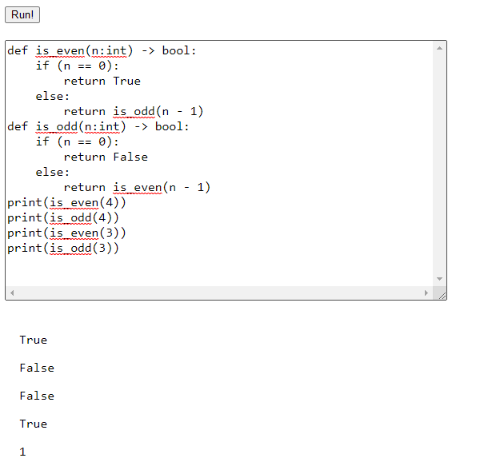

# CSE 231 PA2

## Representation of values 


## Example program
```python
x:int = 5
def func(z:int):
    y:int = 4
    if z<y:
        print(z)
    else:
        print(y)
func(x)
```
**ast.ts**
```typescript
export type VarDef<A> = {
  a?: A, name: string,
  type: Type,
  init: Literal<A>
}

export type FunDef<A> = {
  a?: A, name: string,
  params: TypedVar<A>[],
  ret: Type,
  inits: VarDef<A>[],
  body: Stmt<A>[]
}

export type TypedVar<A> = { a?: A, name: string, type: Type }
```


## Infinite loop

```python
x:int = 9
while x<10:
    print(x)
```

When this infinite loop is run on a web browser, the webpage hangs

## Screenshots

1. A program that reports a type error for adding a number and a boolean where one operand is a call expression and the other operand is a variable.
    ```python
    x:int = 10
    def func(x:int)->bool:
        return x>5
    x + func(x)
    ```
    

2. A program that has a type error in a conditional position, where that position is a non-global identifier.
    ```python
    p : bool = True
    def f(q : bool) -> int:
        if q < 25:
            return 99
        else:
            return 500
    print(f(p))
    ```

    

3. A program that with a loop that has multiple iterations, and calls a function on each iteration
    ```python
    x:int = 5
    def my_print(x:int):
        print(x)
    while x>0:
        my_print(x)
        x = x-1    
    ```

    

4. A program that returns from the body of a loop, and not on the first iteration of the loop
    ```python
    def func(x:int)->int:
        while x > 0:
            x = x-2
            if x < 0:
                return -x
        return x
    print(func(4))
    func(5)
    ```

    

5. Printing an integer and a boolean
    ```python
    x:int = 4
    y:bool = True
    print(x)
    print(y)    
    ```

    

6. A recursive function that terminates (e.g. no stack overflow)
    ```python
    def sum(n : int) -> int:
        if n < 1: return 0
        else: return sum(n - 1) + n
    sum(4)
    ```
    
7. Two mutually-recursive functions that terminate.
    ```python
    def is_even(n:int) -> bool:
        if (n == 0):
            return True
        else:
            return is_odd(n - 1)
    def is_odd(n:int) -> bool:
        if (n == 0):
            return False
        else:
            return is_even(n - 1)
    print(is_even(4))
    print(is_odd(4))
    print(is_even(3))
    print(is_odd(3))
    ```
    

## Type Errors

In (1) TypeError occurs as we try to add a ```bool``` and an ```int``` which is not supported. In case of Binary operators for operators ```+,-,*,//,%,<,<=,>,>=```, it is ensured that both left and right hand operators are ```int```. For the operators ```==,!=``` it is ensured that left and right are either both ```int``` or both ```bool```. For ```is```, it is ensured that both left and right hand operators are ```None```. It can also be noted that type of evaluated expression where the operators are ```+,-,*,//,%``` is ```int``` and for the operators ```<,<=,>,>=,==,!=,is``` is ```bool```. 

**Code Snippet:**
```typescript
function typeCheckExpr(expr: Expr<null>, env: TypeEnv): Expr<Type> {
  switch (expr.tag) {
    case "binexpr":
      const left = typeCheckExpr(expr.left, env);
      var right = typeCheckExpr(expr.right, env);
      switch (expr.op) {
        case BinOp.Add:
        case BinOp.Sub:
        case BinOp.Mul:
        case BinOp.Div:
        case BinOp.Mod:
          if (left.a !== Type.int || right.a !== Type.int) {
            throw new TypeError(`Cannot apply operator \`${expr.op}
            \` on types \`${left.a}\` and \`${right.a}\``)
          }
          return { ...expr, left, right, a: Type.int }
        case BinOp.Lesser:
        case BinOp.LessEq:
        case BinOp.GreatEq:
        case BinOp.Greater:
          if (left.a !== Type.int || right.a !== Type.int) {
            throw new TypeError(`Cannot apply operator \`${expr.op}
            \` on types \`${left.a}\` and \`${right.a}\``)
          }
          return { ...expr, left, right, a: Type.bool }
        case BinOp.Equals:
        case BinOp.NotEquals:
          if (left.a !== right.a || right.a === Type.none) {
            throw new TypeError(`Cannot apply operator \`${expr.op}
            \` on types \`${left.a}\` and \`${right.a}\``)
          }
          return { ...expr, left, right, a: Type.bool }
        case BinOp.Is:
          if (left.a !== Type.none || right.a !== Type.none) {
            throw new TypeError(`Cannot apply operator \`${expr.op}
            \` on types \`${left.a}\` and \`${right.a}\``)
          }
          return { ...expr, left, right, a: Type.bool }
      }
      break;
      ...
  }
```

## Resources
* TA Office hours was very helpful.
* lecture 4 code.
* WASM instruction guides.


